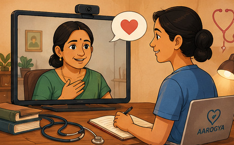
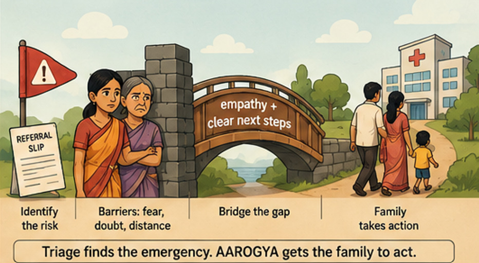
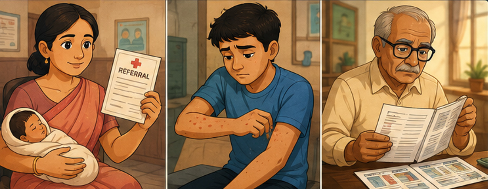
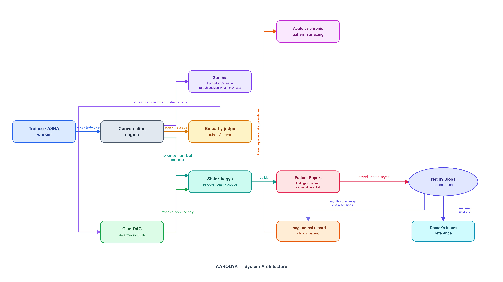
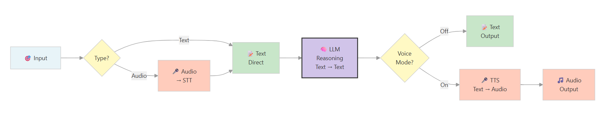
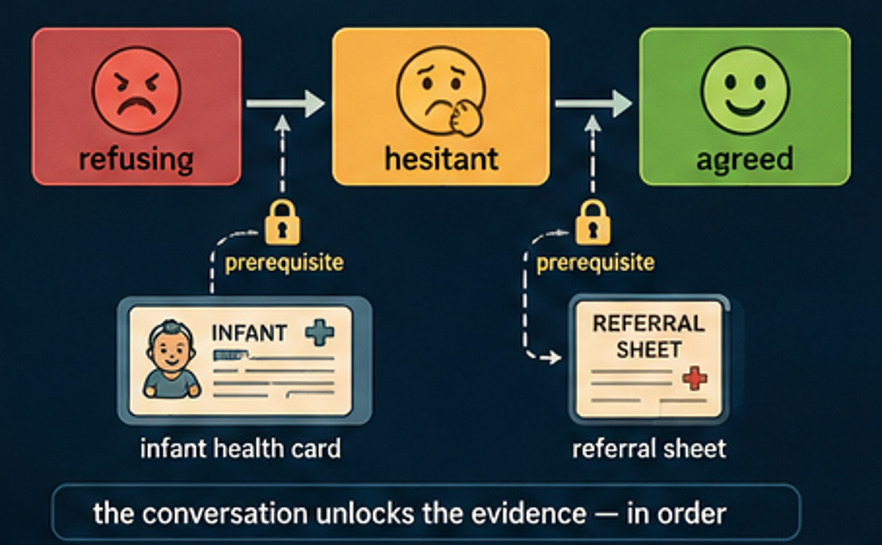
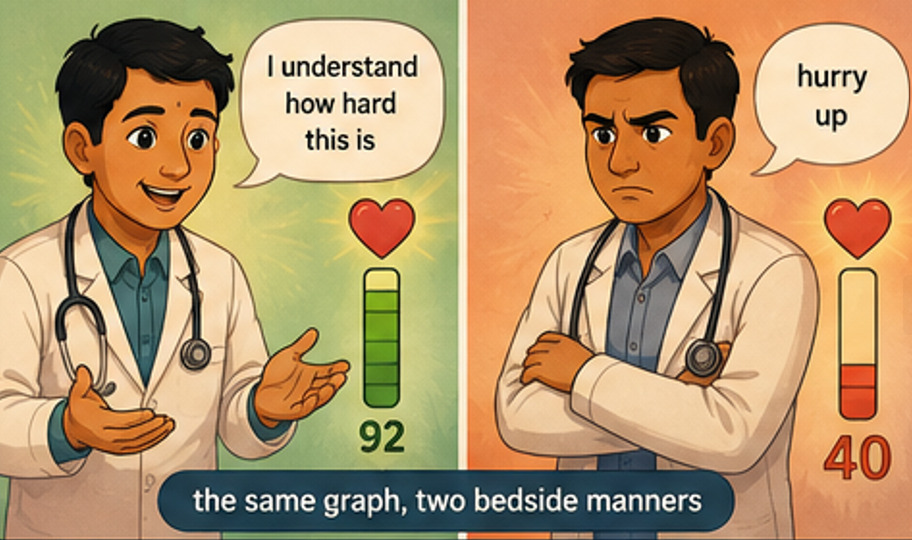
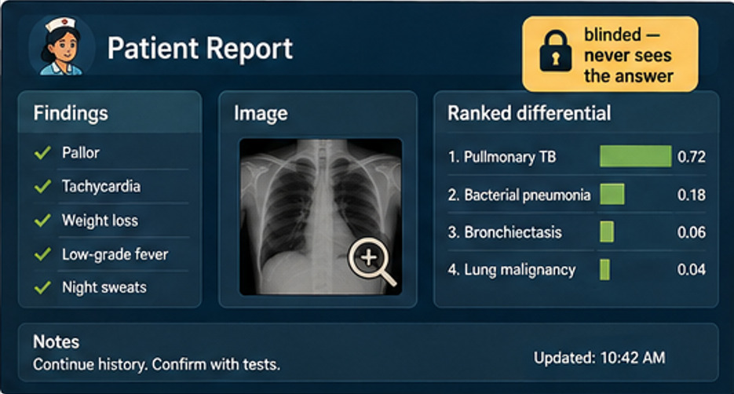
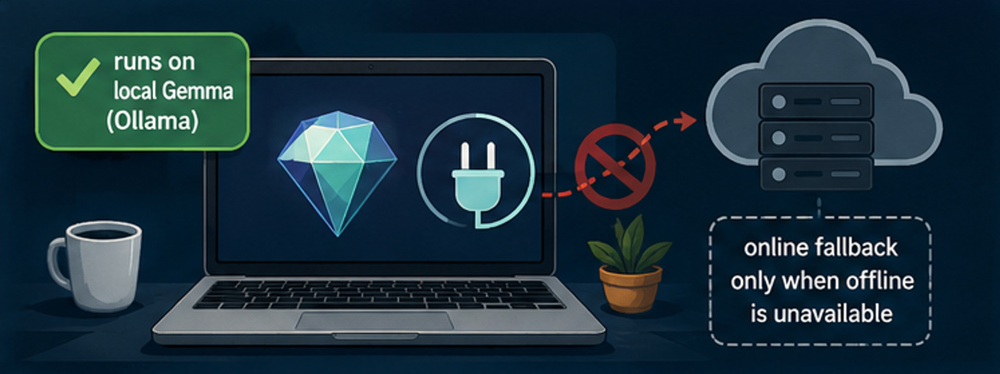

# AAROGYA - *Doctor's Copilot in the telehealth era*


## *▶ Live demo - [https://aarogyachat.netlify.app/](https://aarogyachat.netlify.app/)*




---

## Contents

- [Intro](#intro)
- [The three cases](#the-three-cases)
- [The architecture: the model may speak, it may not decide](#the-architecture-the-model-may-speak-it-may-not-decide)
- [Voice-enabled conversations](#voice-enabled-conversations)
- [The empathy tracker: how Gemma measures bedside manner](#the-empathy-tracker-how-gemma-measures-bedside-manner)
- [Mimicking real patient behaviour: the DAG and empathy](#mimicking-real-patient-behaviour-the-dag-and-empathy)
- [Sister Aagya: the AI copilot](#sister-aagya-the-ai-copilot)
- [The longitudinal record: acute vs chronic](#the-longitudinal-record-acute-vs-chronic)
- [Why these models](#why-these-models)
- [Quick start](#quick-start)
- [Tests](#tests)
- [Repository layout](#repository-layout)
- [Why it's GenAI for Good](#why-its-genai-for-good)

---

## Intro

India is scaling telemedicine because it has no other choice. eSanjeevani - the
world's largest primary-care telemedicine rollout - has delivered **31.86 crore
teleconsultations**, about **4.35 lakh patients a day**, against a backdrop of
**one allopathic doctor per 1,263 people** (rural districts as low as one per
11,000). Virtual care is not a stopgap; it is how the load gets met.

But a teleconsultation is a conversation - and the conversation is the
unprepared part. No physical exam. A guarded patient behind a screen. A
frightened family deciding whether to act on what the doctor just said. Every
virtual referral ends the way the in-person one does: with a family that can
say no. The sickest moment in Indian health is still the one where the doctor's
words must become a family's decision - and through a screen, that moment is
harder, not easier.

AAROGYA trains that conversation. It is a virtual patient who refuses,
hesitates, and only acts when the trainee earns it - built for the people who
actually run India's virtual consultations: doctors and nurses at the
telemedicine hubs, and the ANMs at the Ayushman Arogya Mandirs who are the
patient's first screen.

**The problem, in numbers:**

| The gap | The number | Why it matters |
|---|---|---|
| Newborn deaths | ~390,000 a year | Many preventable, often preceded by a refused referral |
| Doctor density | ~1 per 1,263; rural as low as 1 per 11,000 | The load can only be met virtually |
| Chronic-disease cost | ~$3.55T in lost output, 2012-2030 | Most of it runs through late detection |
| The chronic load | ~10.1 crore diabetic, 13.6 crore prediabetic | Follow-up at this scale is a virtual-care problem |

*(Full, sourced breakdown in [intro.md](intro.md).)*

**Virtual care is the answer - AAROGYA is its human side.** Remote monitoring
cuts chronic-disease hospital readmissions by up to **38%** and hospitalization
costs by up to **25%**. But a virtual follow-up only works when the person
running it can build trust through a screen - and keep the record that makes
the next visit worth having. That is what AAROGYA trains, and what its
longitudinal record delivers.

**What AAROGYA does.** A trainee holds an open-ended conversation with a
Gemma-powered patient who refuses, hesitates, and only acts when the
conversation earns it - rehearsing the exact moves that take a family from
refusal to action. An algorithm scores not just *what* you asked but *how* you
asked it, and a blinded nurse-analyst agent builds a live Patient Report - the
seed of the longitudinal record that makes virtual follow-up worth having: the
doctor sees the curve, not a snapshot, and a quiet trend can be flagged before
a deadly disease forces a late diagnosis.



## The three cases

| Case | The scenario |
|---|---|
| **Sunita - The Refusing Mother** | A 22-year-old refuses the district-hospital referral for her 10-day-old infant with danger signs. The diagnosis is already made - the battle is the conversation. |
| **Arun - Itchy Rash** | A 19-year-old hostel student with an intensely itchy rash between the fingers. Classic history-and-exam detective work. |
| **Shambu - I am feeling breathlessness** | A 72-year-old on a remote consult, guarded through a screen. The disease is deliberately hidden - you earn it. |



## The architecture: the model may speak, it may not decide

The risk in letting an LLM play a patient is hallucination - it invents a
symptom that isn't in the case, and the trainee learns something false. So the
truth never lives in the model:

> **The LLM writes the patient's voice. The graph holds the medical truth.**

Every case is a **deterministic clue graph**. Facts unlock in order - Sunita's
fear has to surface before the health card can be shown; the diagnosis commit
is checked **in code** against ground truth, never by the model. Gemma's job is
*expression*, not *truth*: the patient physically cannot reveal a finding that
is not in the case. That is what makes AAROGYA a trainer rather than a chatbot -
what the trainee learns is trustworthy, and the scoring is reproducible.



## Voice-enabled conversations

Voice is a **first-class input** in the browser - and it is wired *around* the
text engine, not instead of it.



- **Speak to the patient (🎙).** The mic captures audio; an in-browser VAD
  stops at end-of-speech; the clip is POSTed to `/api/stt`, where **Whisper
  large-v3** is the real speech-to-text decider. The transcript then enters the
  *same* chat pipeline as typing.
- **Hear the patient (🔊).** Every reply is POSTed to `/api/tts`, where a short
  **director** call first injects natural stage directions - `[coughs]`,
  `[voice cracks]`, `[long pause]` - then **Gemini TTS** (with a Fish TTS
  fallback) renders it aloud in that character's voice preset.
- **Text stays primary; audio is a second rendering of the same reply.** The
  transcript, the graph, and the report are all built from text - voice is a
  convenience layer, never a separate memory that could drift.



## The empathy tracker: how Gemma measures bedside manner

Every message is scored twice - once deterministically, once by Gemma - and the
two legs agree on purpose.

```js
// 1 · Deterministic first pass - instant, offline, always available.
const tone = classifyTone(msg);               // 'empathetic' | 'neutral' | 'rude'
state.empathy.score += TONE_DELTA[tone];      // { empathetic: 1, neutral: 0, rude: -5 }

// 2 · Gemma grades the same message against the rubric (fire-and-forget -
//    it corrects the score a moment later, never blocks the patient reply).
judgeEmpathy(msg, tone);
```

Gemma's judge prompt is anchored to a real communication framework:

```
Grade the doctor's latest message for empathy.
Rubric (SPIKES + Calgary-Cambridge): 1) acknowledge the situation or the
patient's feelings, 2) name the fear or elicit the concern, 3) give clear next
steps that involve the family, 4) respect the patient's decision. A plain
greeting or check-in is NEUTRAL (40-70); rude (<40) is reserved for dismissing,
pressuring, mocking, or insulting the patient.
Score <40 rude · 40-70 neutral · >70 empathetic.
Reply with ONLY JSON: {"score": 0-100, "label": "...", "rationale": "<one
sentence, quote the doctor>"}.
```

**Why two legs?** The rule classifier is stable, instant, and works offline -
the score never breaks if the model is down. Gemma adds *judgment*: it reads the
actual message against the rubric and corrects the running score, writing a
rationale that **quotes your own words** - so the empathy score is both live and
auditable. And the patient *reacts* to the tone tier: a kind doctor finds a wall
lowering (the patient reveals on the first ask); a curt one meets a guarded
wall. That emotional response is voiced by Gemma.



## Mimicking real patient behaviour: the DAG and empathy

A bare LLM cannot be a dependable patient. Gemma alone would hallucinate - invent
a symptom, forget what it already said, or hand out the diagnosis. Two systems
exist to make the simulation behave like a real person:

- **The DAG creates determinism.** The clue graph is the single source of truth:
  what the patient knows, what it must not reveal, and in what order. The
  diagnosis commit is a state transition **in code** - so the encounter is
  reproducible and fair every time. The model can only voice what the graph
  has unlocked; it cannot improvise clinical facts.
- **Empathy shapes the reveal.** *How* you ask changes *when* the patient opens
  up. The denial threshold depends on your tone - empathetic or neutral doctors
  earn a reveal on the first direct ask, rude doctors are deflected until the
  third. The patient's guard is real, and it is your bedside manner that lowers
  it.
- **It also channels Gemma efficiently across characters.** Patient, family, and
  records each get their own persona, their own hidden-clue set, and their own
  conversation thread - but every prompt is rebuilt from the **same graph
  state**, so no character drifts, no character contradicts another, and no
  context window has to hold the whole case. Gemma is given exactly the slice it
  needs for this turn, nothing more. That is how a multi-character conversation
  stays coherent without hallucination.

## Sister Aagya: the AI copilot

India has roughly **one doctor per thousand people** - and in the public system
that ratio is far worse. A clinician on OPD sees a patient every few minutes:
there is no time to build a careful longitudinal picture, and the notes that
would carry it often never get written. **Aagya is built for that gap.**

Sister Aagya is the AI nurse-analyst embedded in every consultation:

- **She builds the Patient Report as you work** - findings, images seen, and a
  **ranked differential** that updates live. The doctor gets a finished,
  organized case file at the end instead of having to reconstruct it.
- **She is structurally blinded.** Her prompt is built from evidence only, and
  the transcript is sanitized to redact the diagnosis before she reaches her.
  She cannot cheat - so her differential is a reasoning aid a doctor can trust.
- **She never breaks.** When the model is unavailable, a deterministic analyser
  keeps the report populated. The record is always there.



This is the pitch: **a doctor with a hundred patients a day cannot also be the
record-keeper, the differential-builder, and the trend-watcher.** Aagya is the
copilot who is. And because every report is saved and organized per patient over
time, she does what a stretched clinician physically cannot - watch the curve.

## The longitudinal record: acute vs chronic

One-off triage tools see a single snapshot. AAROGYA keeps the *timeline*.

```mermaid
flowchart LR
    T["Trainee / ASHA worker"] -->|"asks a question · text or voice"| C["Conversation engine"]
    C -->|"patient's reply"| P["Gemma · the patient's voice<br/>(the graph decides what it may say)"]
    C -->|"every message"| J["Empathy judge · rule + Gemma"]
    C -->|"evidence + sanitized transcript"| A["Sister Aagya · blinded Gemma copilot"]
    DAG["Clue DAG · deterministic truth"] -->|"revealed evidence only"| A
    P -->|"clues unlock in order"| DAG
    A -->|"builds"| R["Patient Report<br/>findings · images · ranked differential"]
    R -->|"saved per trainee · name-keyed"| DB[("Netlify Blobs · the database")]
    DB -->|"resume / next visit"| F["Doctor's future reference"]
    DB -->|"monthly checkups chain sessions"| L["Longitudinal record · chronic patient"]
    L -->|"Gemma-powered Aagya surfaces"| AC["Acute vs chronic pattern surfacing"]
```



- **Every report is saved.** Each encounter is snapshotted into the trainee's
  name-keyed profile and mirrored to **Netlify Blobs** (localStorage is the fast
  cache; Blobs make it cross-device). That is the database - no setup, no
  schema, keyed by the trainee's name.
- **It is the doctor's future reference.** A name-keyed resume restores the last
  case and its report; prior reports stay organized under that trainee - so a
  doctor revisiting a patient opens yesterday's findings, not a blank screen.
- **And that persistence is the innovation.** The chronic patient (Shambu, T2DM)
  runs structured monthly checkups that chain session to session. Over that
  timeline, a Gemma-powered Aagya can separate a *new acute flare* from a
  *stable chronic trend* - "the rash is new since last month, but the weight has
  been falling for three visits." A sustained downward weight curve, a fatigue
  that never resolves, a sore that won't close: these are the quiet patterns
  that, **flagged early, can send someone for screening long before a deadly
  disease - cancer, a chronic infection - forces a late diagnosis.** That is
  longitudinal clinical reasoning no current one-shot methodology produces.

## Why these models

- **Gemma is the brain - and only the brain.** Patient voice, empathy judge,
  copilot. It is a text model, so audio is carried by purpose-built models, not
  forced onto it.
- **Whisper decides speech-to-text.** We verified that a chat model doing ASR
  *fabricates* transcripts it cannot hear (a silent clip returned a made-up
  sentence) - a medical trainer can't accept that. So Whisper is the decider,
  never the guesser.
- **Gemini TTS** speaks the patient after a short "director" pass adds natural
  stage directions. TTS is transport, not intelligence.
- **Ollama-first, OpenRouter-second** makes offline honest: a training-center
  laptop with Ollama runs fully local; deployed falls back because a server
  cannot reach a laptop's Ollama - by design, not a bug.
- **The graph, not the model, holds the truth** - diagnosis commit in code,
  evidence earned in order, the copilot blinded, a deterministic fallback
  behind every leg. That is the tradeoff that makes it a trainer, not a
  chatbot.

## Quick start

```bash
cd V7
cp .env.example .env     # fill OPENROUTER_API_KEY (+ GEMINI_API_KEY for audio)
npm install              # @netlify/blobs for name-keyed resume
netlify dev              # local: Ollama-front, OpenRouter fallback
```

With local **Ollama** running (`gemma4:e2b-it-qat`), the app is fully offline.
Without it, every call falls through to OpenRouter.



## Tests

```bash
python -m pytest tests/ -q          # datapack schema, game-end gating, voice registry, blinding
node tests/test_dag_gate.mjs        # DAG-gated artifact reveals
node tests/test_empathy_judge.mjs   # SPIKES/Calgary-Cambridge judge contract
node tests/test_analyser.mjs        # ranked differential + visible-lead gate
node tests/test_eval_set.mjs        # 20-utterance eval harness (mock + live legs)
node tests/test_tone.mjs            # tone classifier + denial thresholds
# … plus aagya, report, store, case-switch, privacy, remote, checkup, analytics, voice
```

## Repository layout

```
aarogya/
├── index.html                    # the app (graph, agents, report, voice, UI)
├── data/                         # 3 cases (mother · scabies · remote)
├── assets/  Images/  readme_imgs/  # clinical image + case/character/README art
├── netlify/functions/openrouter.js  # Ollama-front → OpenRouter/Gemini cascade + /stt + /tts
├── netlify.toml
├── tests/                        # deterministic + mock suites, all green
├── SECURITY.md                   # blinding, DAG-truth, no-PHI, key handling
├── writeup.md                    # the Kaggle writeup
├── intro.md                      # the numbers behind the last mile (sources)
├── README.md · CREDITS.md · LICENSE · .env.example · .gitignore
└── spec.md · characterprompt.md · situationprompt.md · imagesprompt.md
```

## Why it's "GenAI for Good"

Standardized-patient training is expensive, scarce, and geographically
concentrated. AAROGYA gives the people who run India's telemedicine - doctors
and nurses at the hubs, ANMs at the Ayushman Arogya Mandirs - a patient who
never tires, never resents a wrong guess, and responds to tone the way a real
person does. It teaches the empathy and communication that make a virtual
consultation work, as a measurable, improvable skill.

---

